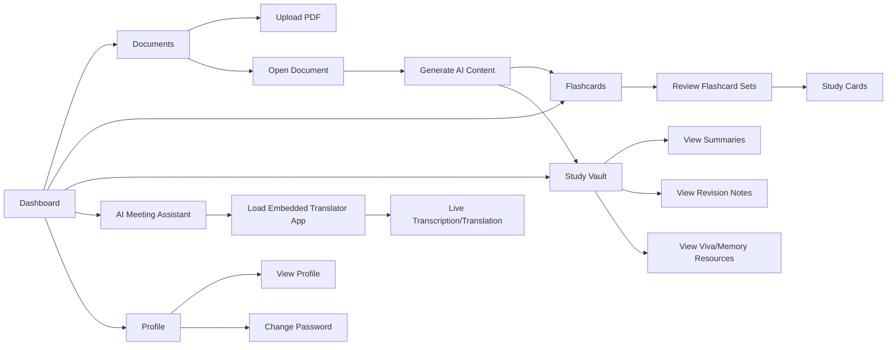

# MEETMIND AI Learning App - User Workflow Chart

This document explains the complete user-facing flow of the project for viewing and usage.

## 1. High-Level User Journey

```mermaid
flowchart TD
    A[User Opens Website] --> B{Authenticated?}
    B -- No --> C[/login]
    B -- Yes --> D[/dashboard]

    C --> E[Login]
    E --> F{Valid Credentials?}
    F -- No --> C
    F -- Yes --> D

    C --> G[Register New Account]
    G --> H[/register]
    H --> I[Create Account]
    I --> C

    D --> J[Use Sidebar Navigation]

    J --> K[/documents]
    J --> L[/flashcards]
    J --> M[/study-vault]
    J --> N[/meeting-assistant]
    J --> O[/profile]

    O --> P[Logout]
    P --> C
```

## 2. Dashboard to Feature Workflow



## 3. Detailed User Flow by Module

### A. Authentication Flow
1. User opens app.
2. If user is not authenticated, app redirects to `/login`.
3. User can:
   - Log in with existing credentials.
   - Go to `/register` to create a new account.
4. After successful login, user is redirected to `/dashboard`.

### B. Documents Flow
1. User opens `Documents` from sidebar.
2. User uploads a PDF document.
3. System stores document and makes it available in document list.
4. User opens document details page.
5. User triggers AI actions (summary/revision/flashcards/quizzes, depending on available actions).

### C. Flashcards Flow
1. User opens `Flashcards` from sidebar.
2. User sees flashcard sets generated from documents.
3. User studies cards one by one.
4. Learning progress is reinforced through repeated review.

### D. Study Vault Flow
1. User opens `Study Vault` from sidebar.
2. User views AI-generated resources grouped by document.
3. User opens resources such as summary, revision, viva, and memory notes.
4. User can remove resources if no longer needed.

### E. AI Meeting Assistant Flow
1. User opens `AI Meeting Assistant` from sidebar.
2. Platform loads embedded translator application inside an iframe.
3. Loading state is shown until iframe completes loading.
4. User uses real-time transcription/translation without leaving MEETMIND.

### F. Profile and Logout Flow
1. User opens `Profile` from sidebar.
2. User views account information.
3. User may change password.
4. User clicks `Logout` from sidebar when done.
5. App redirects back to `/login`.

## 4. Route Map (User View)

- Public routes:
  - `/login`
  - `/register`

- Protected routes (require authentication):
  - `/dashboard`
  - `/documents`
  - `/documents/:id`
  - `/documents/:id/flashcards`
  - `/quizzes/:quizId`
  - `/quizzes/:quizId/results`
  - `/study-vault`
  - `/meeting-assistant`
  - `/profile`

## 5. Sidebar Navigation Order (User Sees)

1. Dashboard
2. Documents
3. Flashcards
4. Study Vault
5. AI Meeting Assistant
6. Profile
7. Logout

## 6. Practical Usage Guide for Users

1. Sign in from `/login`.
2. Start with `Documents` and upload your study material.
3. Generate and review `Flashcards` and quizzes from your content.
4. Use `Study Vault` for consolidated AI notes.
5. Open `AI Meeting Assistant` during live classes/meetings.
6. Update account details in `Profile`.
7. Logout when your session is complete.

---

If needed, this workflow can be converted into:
- an admin workflow chart,
- a developer architecture chart,
- or a backend API sequence diagram.
